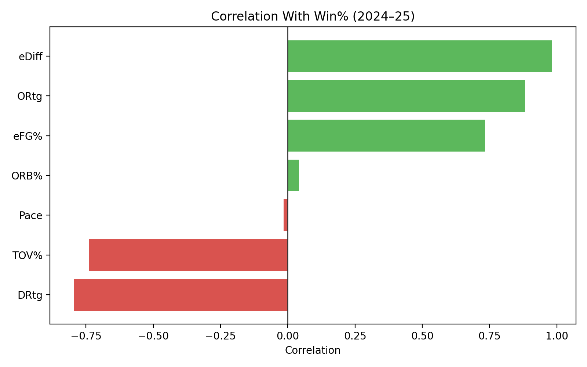
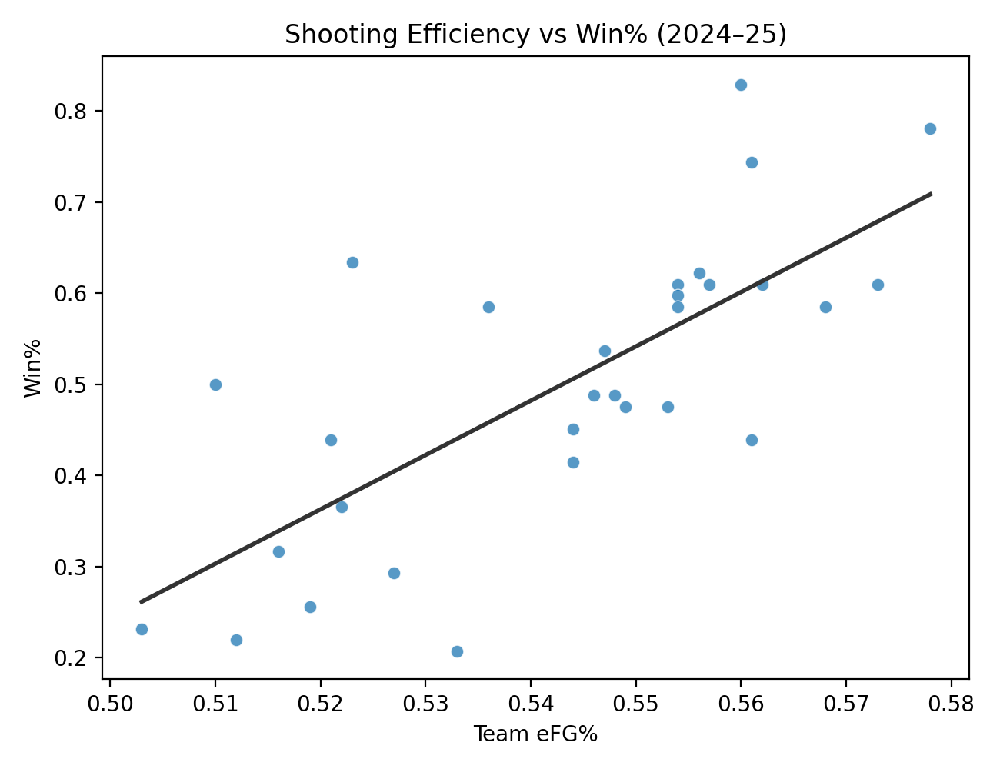
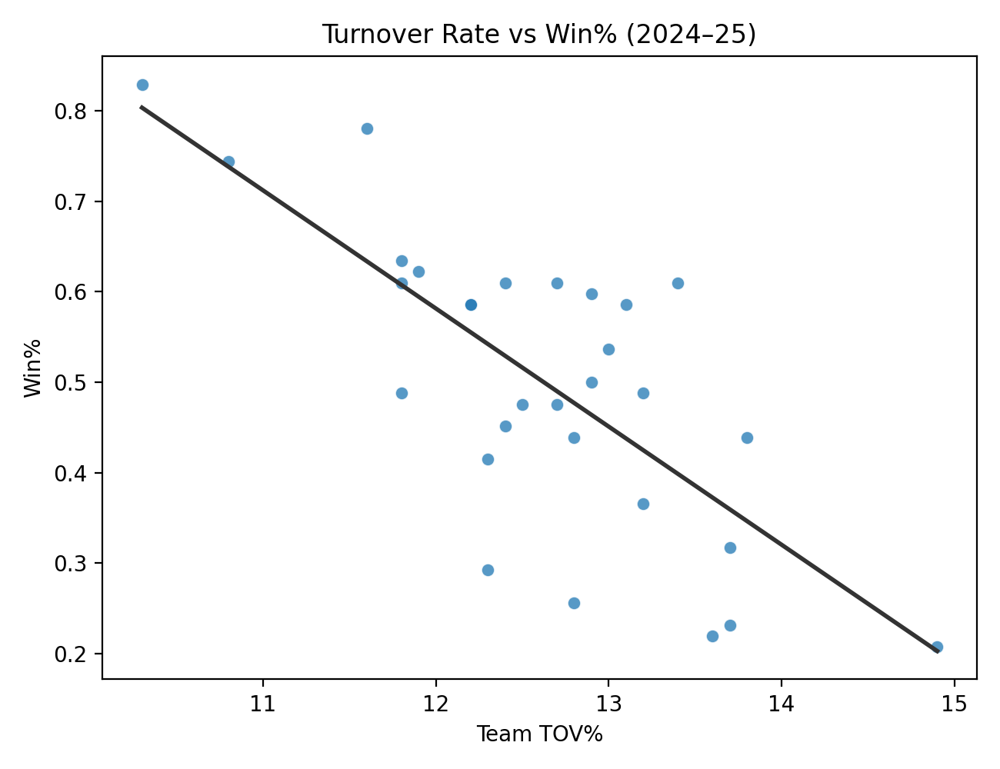
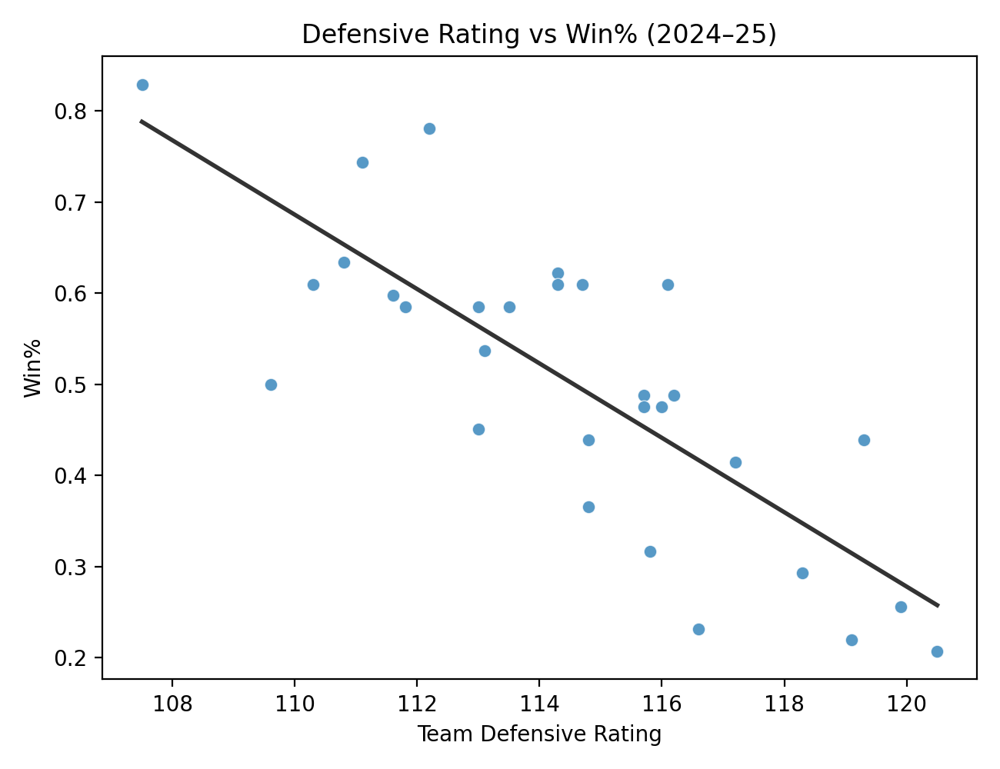

# Basketball Statistics — Chapter Exercises

This repo contains my **solutions** to the end‑of‑chapter exercises from *Learn to Code with Basketball*. I focused on **pandas (Python)**, **R**, and **Tableau‑oriented visualization steps**, with SQL where required.

## What’s Included
- `solutions/ch01_introduction.md`
- `solutions/ch02_python.md`
- `solutions/ch03_pandas.md`
- `solutions/ch04_sql.md`
- `solutions/ch06_data_viz.md`
- `solutions/ch07_modeling.md`
- `scripts/` — runnable scripts for Chapters 3, 6, 7
- `figures/` — generated plots from Chapter 6

## Tableau Dashboard
I built a **strong, interactive Tableau dashboard** to explore team shooting behavior and outcomes, with linked views for distributions, scatter relationships, and team rankings.

**Insights snapshot:** The distributions show heavy clustering around low‑to‑mid 3PA ranges, while the scatter suggests only a weak relationship between 3PT volume and FT%. Team‑level views highlight clear variation in 3PA volume and win rates, making it easy to spot outliers and potential strategic styles.

Key views:
- 3PT Attempts Distribution (Win vs Loss)
- 3PT Attempts vs FT% (scatter with win/loss color)
- Average 3PT Attempts by Team
- Win Rate by Team

Images:

## Business Insight: Team Styles That Drive Wins (2024–25)
This section is **separate from the chapter exercises** and focuses on a business‑style question using league‑wide team stats.

**Business question:** Which team styles are most associated with winning?

**Data source:** Team advanced stats and standings (RealGM, 2024–25).

**Summary of findings (2024–25):**
- **Efficiency margin (net rating)** is the strongest driver of win%.
- **Shooting efficiency (eFG%)** is strongly positive with win%.
- **Turnovers (TOV%)** are strongly negative with win%.
- **Defense (lower DRtg)** is strongly associated with higher win%.
- **Pace** has little relationship with win%.

**Data + visuals generated with Python:**
- `analysis/data/nba_2024_25_team_styles.csv`
- `analysis/scripts/team_style_insights.py`
- `figures/insight_corr_winpct.png`
- `figures/insight_efg_winpct.png`
- `figures/insight_tov_winpct.png`
- `figures/insight_drtg_winpct.png`

Images:

## Tools Used
- Python (pandas, matplotlib, statsmodels, scikit‑learn)
- R (dplyr, ggplot2, randomForest)
- SQL (standard / SQLite style)
- Tableau (visualization workflow notes)

## Notes
- The PDF book is **not** included in this repo.
- Some exercises depend on local datasets referenced in the book (e.g., `./data/...`). The solutions show the code and logic; you can plug in your local paths to run them.
  - Set `DATA_DIR` when running scripts, e.g. `DATA_DIR=/path/to/data python3 scripts/ch06_viz.py`.
